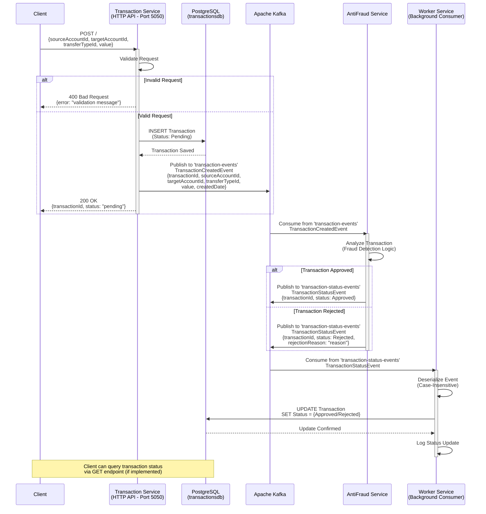
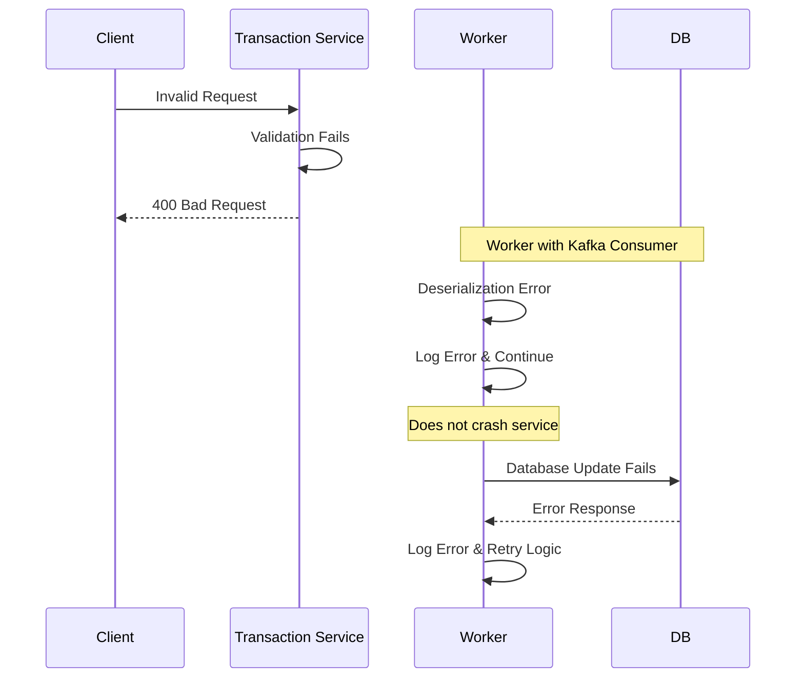

# Transaction Service - Sequence Diagram

## Complete Transaction Flow



## Event Details

### 1. TransactionCreatedEvent
Published by Transaction Service to `transaction-events` topic.

```json
{
  "transactionId": "a1b2c3d4-e5f6-7890-abcd-ef1234567890",
  "sourceAccountId": "3fa85f64-5717-4562-b3fc-2c963f66afa6",
  "targetAccountId": "4fb96f75-6828-5673-c4gd-3d074g77bgb7",
  "transferTypeId": 1,
  "value": 100.50,
  "createdDate": "2025-10-24T10:30:00Z"
}
```

### 2. TransactionStatusEvent
Published by AntiFraud Service to `transaction-status-events` topic.

```json
{
  "transactionId": "a1b2c3d4-e5f6-7890-abcd-ef1234567890",
  "status": 2,
  "rejectionReason": null
}
```

**Status Values:**
- `1` - Pending
- `2` - Approved
- `3` - Rejected

## Architecture Patterns

### Event-Driven Architecture
- **Asynchronous Processing**: Transaction creation and fraud analysis are decoupled
- **Scalability**: Services can scale independently
- **Resilience**: Kafka provides message persistence and replay capability

### CQRS Pattern
- **Commands**: `InsertAsync` for transaction creation
- **Queries**: Repository pattern for data retrieval
- **Separation**: Write and read operations are separated

### Domain-Driven Design
- **Entities**: `Transaction` with business rules
- **Value Objects**: `TransactionStatus` enum
- **Events**: Domain events for cross-service communication

## Infrastructure Components

### PostgreSQL Database
- **Database**: `transactionsdb`
- **Port**: `5432`
- **Tables**: Transactions

### Apache Kafka
- **Port**: `9092`
- **Topics**: 
  - `transaction-events` (produced by Transaction Service)
  - `transaction-status-events` (consumed by Worker)

### Zookeeper
- **Port**: `2181`
- **Role**: Kafka cluster coordination

## Error Handling



## Performance Considerations

- **Kafka Partitioning**: Enables parallel processing
- **Consumer Groups**: `transaction-service-group` ensures message delivery
- **Database Indexing**: TransactionId indexed for fast lookups
- **Async/Await**: Non-blocking operations throughout the stack

## Viewing the Diagram

To view this diagram:

1. **GitHub**: Automatically renders Mermaid diagrams in markdown
2. **VS Code**: Install "Markdown Preview Mermaid Support" extension
3. **Online**: Copy to https://mermaid.live/
4. **Documentation Tools**: Supports Mermaid (GitBook, Docusaurus, etc.)
